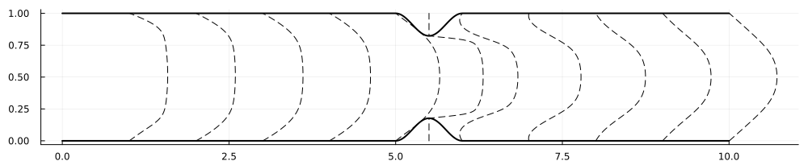
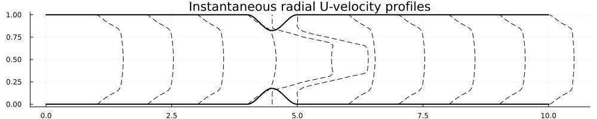

# CardioVascularFlow.jl

Examples of cardiovascular flow and benchamrk cases simulations using [WaterLily.jl](https://github.com/WaterLily-jl)

## Examples

### 2D arterial stenosis

The stenosis is modelled as a simple harmonic constriction of the form 
```math
h(x,r) = \begin{cases}
\sqrt{\text{stenosis}}\frac{1}{2}(1-2\cos(2π x/2D)), & x_0 \le x \le x_0+2D\\
0, & \text{otherwise.}
\end{cases}
```
where $D$ is the diameter of the artery and $\text{stenosis}$ is the percentage of the stenosis. The stenosis is modelled in 2D and 3D. The 2D stenosis is shown below


the velocity profiles obtained from the simulation are shown below



### 3D arterial stenosis


In 3D, the simulation is axisymmetric and the results are radially averaged. The velocity profiles obtained from the simulation are shown below (these are instantaneous results)



### 3D FDA nozzel

The FDA nozzle is a simple nozzle with a contraction and expansion that follows

$$
\begin{equation{}}

