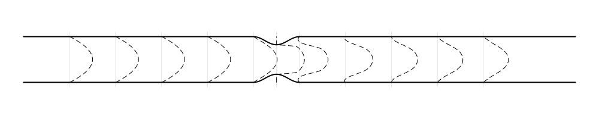

# CardioVascularFlow.jl

Examples of cardiovascular flow and benchamrk cases simulations using [WaterLily.jl](https://github.com/WaterLily-jl)

## Examples

### 2D arterial stenosis

The steosis is modelled as a simple harmonic constriction of the form 
$$h(x,r) = \begin{cases}
\frac{\sqrt{\text{stenosis}}}{2}(1-2\cos(2π x/D)), & 5D \le x \le 5.5D\\
0, & \text{otherwise.}
\end{cases}
$$ 

where $D$ is the diameter of the artery and $\text{stenosis}$ is the percentage of the stenosis. The stenosis is modelled in 2D and 3D. The 2D stenosis is shown below

the velocity profiles obtained from the simulation are shown below

### 3D arterial stenosis

In 3D, the simulation is axisymmetric and the results are radially averaged. The velocity profiles obtained from the simulation are shown below (these are instantaneous results)

### 3D FDA nozzel

The FDA nozzle is a simple nozzle with a contraction and expansion. 

